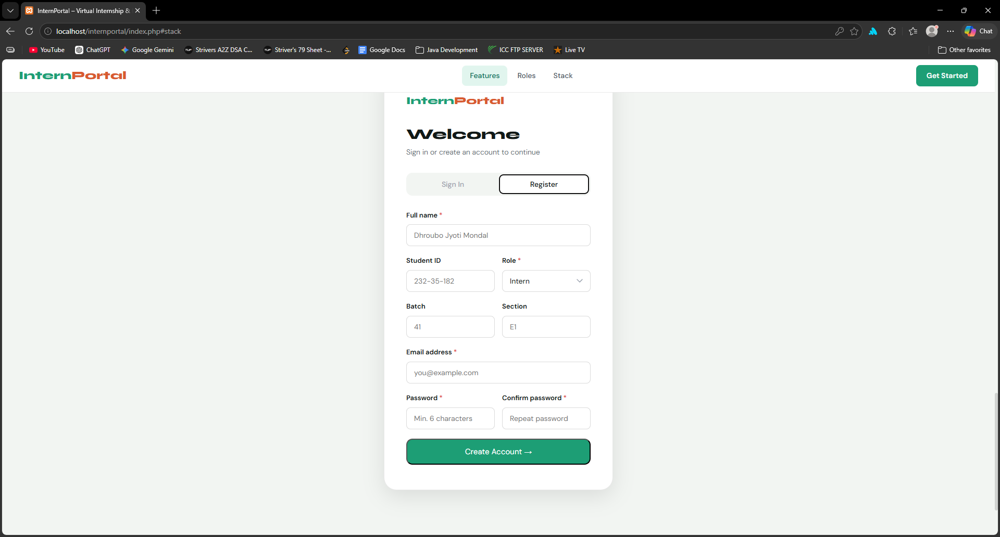
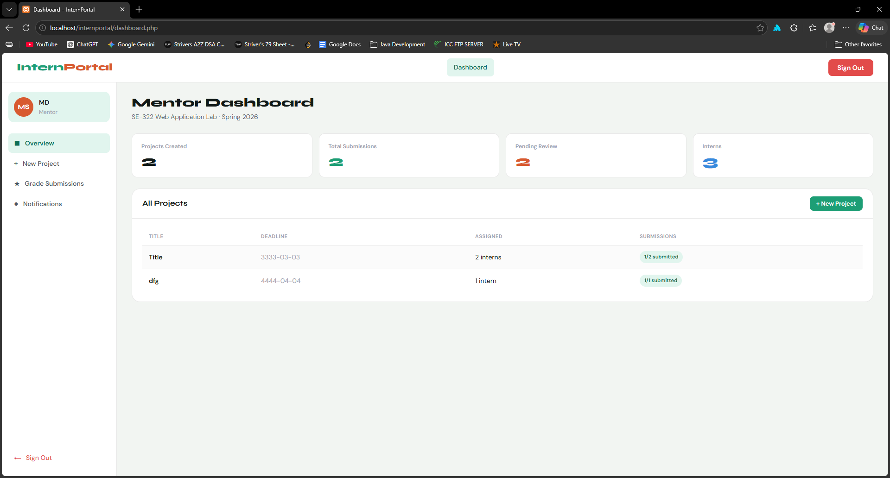
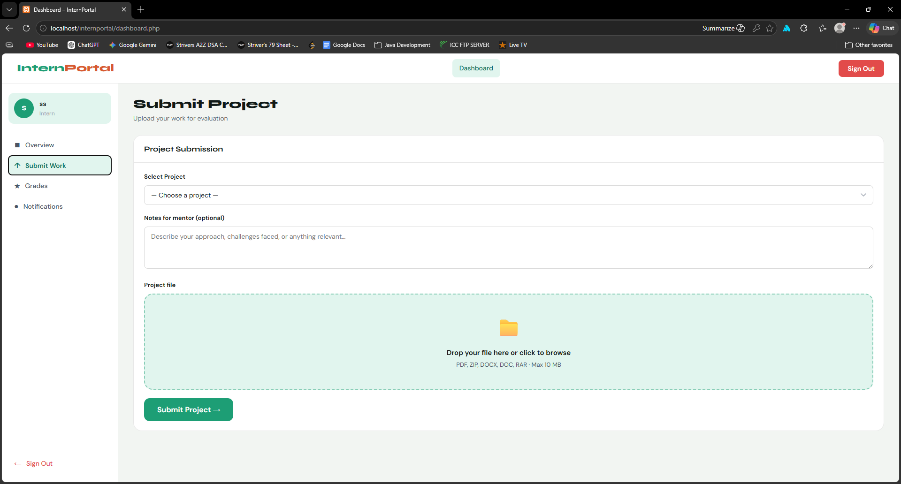

# InternPortal-

InternPortal is a web application where mentors assign projects and interns submit their work. It’s simple, fast, and easy to set up locally.

---

## Features
- Mentors can create and assign projects.
- Interns can register, log in, and submit projects.
- User-friendly interface for smooth project management.

---

## Tech Stack
- Frontend: HTML, CSS, JavaScript  
- Backend: PHP  
- Database: MySQL (via XAMPP)  

---

## Website Link
https://internportal.infinityfreeapp.com/

## Usage
1. **Register** as a new user (intern or mentor).  
2. **Log in** to access your dashboard:  
- Mentors: assign and manage projects  
- Interns: view projects and submit work  

---

## Screenshots

  
(Screenshots/intern_dashboard.png)  
  
